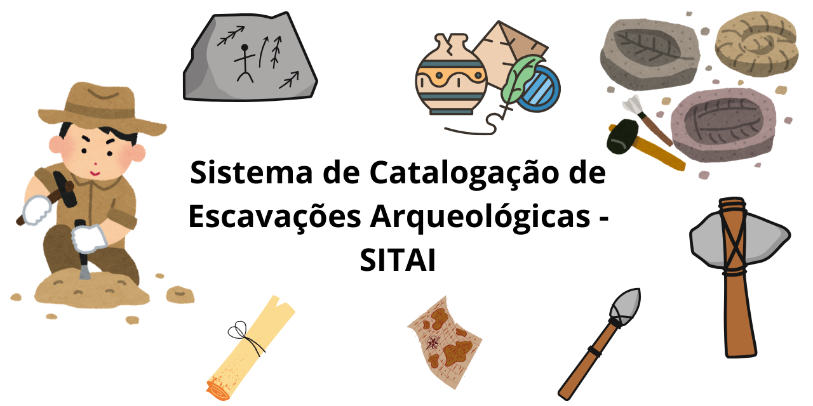

# SITAI - Sistema de Catalogação de Escavações Arqueológicas

[](https://opensource.org/licenses/MIT)
[](https://www.python.org/downloads/)

<p align="center">
  
</p>

## 📋 Descrição

SITAI é um sistema CRUD para catalogação e gestão de dados de escavações arqueológicas relacionadas a antigas comunidades indígenas da Amazônia. O sistema permite registrar pontos de escavação com coordenadas geográficas, tipos de artefatos, descrições detalhadas e outros metadados relevantes.

Desenvolvido para atender às necessidades do Grupo de Pesquisa Arqueológica da Amazônia, que anteriormente utilizava métodos manuais de registro (cadernos e planilhas), resultando em um processo caótico e ineficiente conforme o volume de dados crescia.

## ✨ Funcionalidades

- **Cadastro (Create)**: Registre novos pontos de escavação com informações detalhadas
- **Visualização (Read)**: Liste todos os pontos cadastrados com opções de ordenação
- **Atualização (Update)**: Edite informações de pontos existentes
- **Remoção (Delete)**: Exclua registros obsoletos ou incorretos
- **Pesquisa**: Filtre pontos por diferentes critérios (tipo, descrição, responsável)

## 🔧 Tecnologias

- **[Python](https://www.python.org/)**: Linguagem de programação principal
- **[Streamlit](https://streamlit.io/)**: Framework para criação da interface web
- **[SQLite](https://www.sqlite.org/)**: Banco de dados para persistência dos dados
- **[Pandas](https://pandas.pydata.org/)**: Manipulação e análise de dados
- **[Pydantic](https://pydantic-docs.helpmanual.io/)**: Validação de dados

## 🗃️ Modelo de Dados

Cada ponto de escavação contém:
- **ID**: Identificador único
- **Tipo de Ponto**: Categoria do achado (cabana, utensílio, artefato, etc.)
- **Coordenadas**: Latitude e longitude
- **Altitude**: Elevação em metros
- **SRID**: Sistema de referência de coordenadas
- **Descrição**: Detalhes sobre a descoberta
- **Data da Descoberta**: Quando o item foi encontrado
- **Responsável**: Pessoa que registrou o achado

## 🚀 Instalação e Uso

### Pré-requisitos
- Python 3.7 ou superior
- pip (gerenciador de pacotes do Python)

### Instalação

1. Clone este repositório:
```bash
git clone https://github.com/erickfaria/sitai.git
cd sitai
```

2. Instale as dependências:
```bash
pip install -r requirements.txt
```

### Execução

No Windows:
```bash
run.bat
```

Ou em qualquer sistema operacional:
```bash
python -m streamlit run sitai/app.py
```

## 📖 Documentação

Para informações detalhadas sobre como usar o sistema, consulte a [documentação completa](docs/usage.md).

## 🤝 Contribuindo

Contribuições são bem-vindas! Veja [CONTRIBUTING.md](CONTRIBUTING.md) para saber como contribuir com o projeto.

## 📜 Licença

Este projeto está licenciado sob a licença MIT - veja o arquivo [LICENSE](LICENSE) para detalhes.

## 📊 Capturas de Tela

<div align="center">
  
  
</div>

## 📞 Contato

Para qualquer dúvida ou sugestão, entre em contato com a equipe de desenvolvimento:
- Email: contato@balaiocientifico.com
- GitHub: [github.com/erickfaria](https://github.com/seu-usuario)